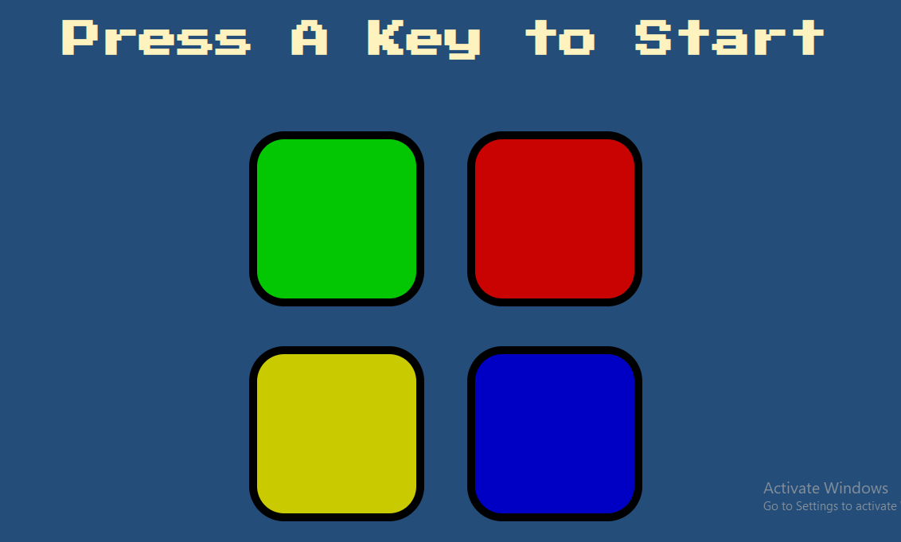
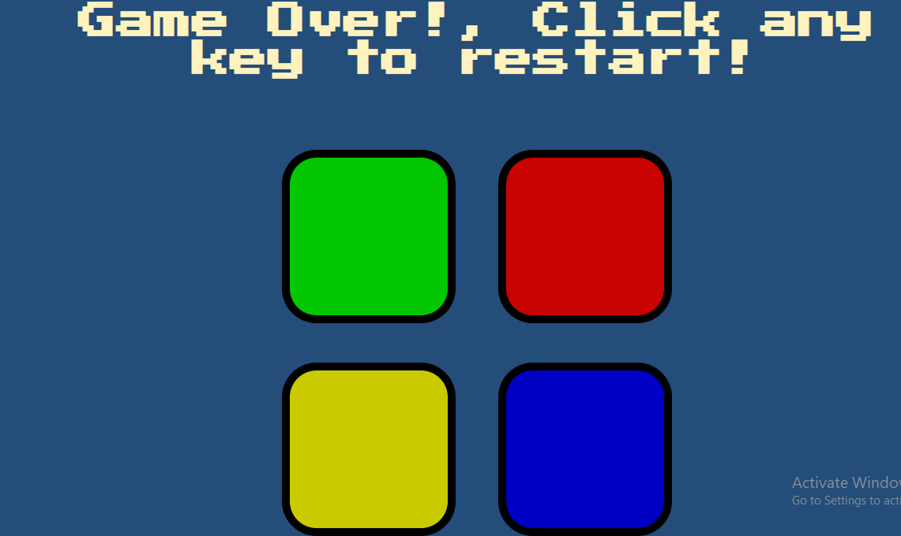

<!-- REMAINING CODE IMPLEMENTATION -->
<!-- 
    - Increase game difficulty and user responding speed at every 5 level subsequently.
 -->

 # SimonGame
This is a game of pattern retention for as long as you can remember. It is a good brain test. 

### Screenshots

## Table of contents

- [Overview](#overview)
  - [Links](#links)
  - [Built with](#built-with)
  - [Update](#Expected-Update)
- [Author](#author)

## Overview
THis is good test of javascript functions and manipulation with DOM, 
A combination of javaScript and JQuery

## How to play
In this game you click any key or button on your keyboard to start,
- then a color beeps
- you click on that color, and another color or the same color beeps again 
- now you have to click the first color that beeped and then the second color that beeped (in that pattern)
- then another color/same beeps(third)
- you click start the pattern from the very first color down to the last.
- if you miss a color during the sequence, you only get warned once(and you should continue exactly where you missed) and then it's game over if you miss again

### Links
- Live Site URL: [live page](https://byron-a.github.io/SimonsGame/)

### Built with

- Semantic HTML5 markup
- CSS 
- JavaScript
- JQUERY

### Expected Update
 - Increase game difficulty and user responding speed at every 5 level subsequently.

## Author
byron-a
My website; https://byron-a.github.io/My_Resume/
